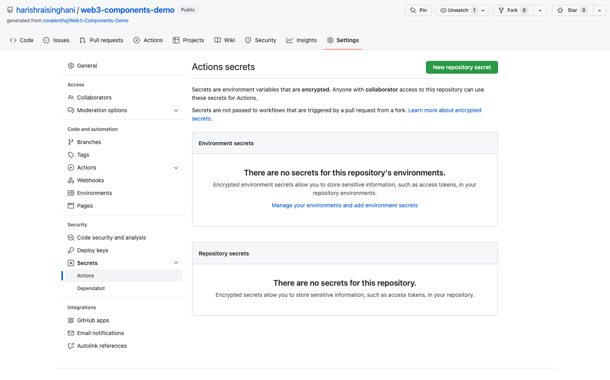
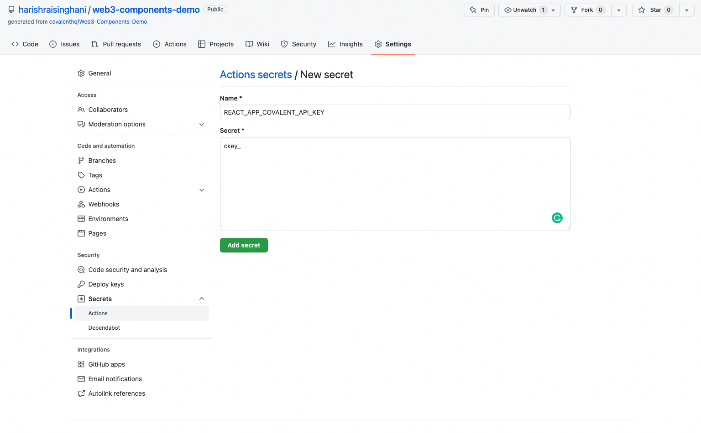
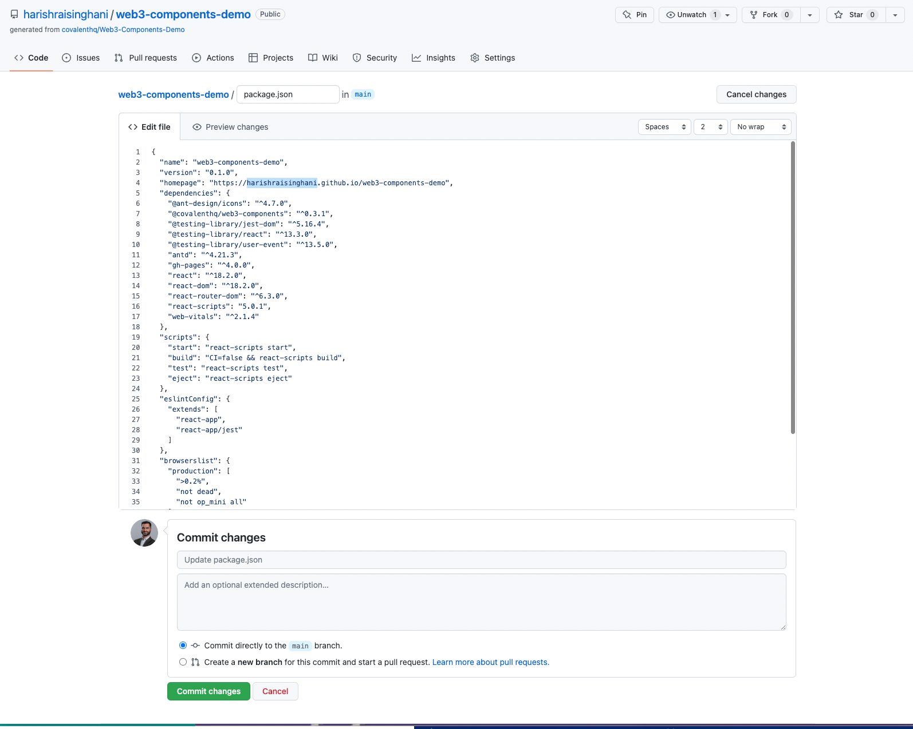
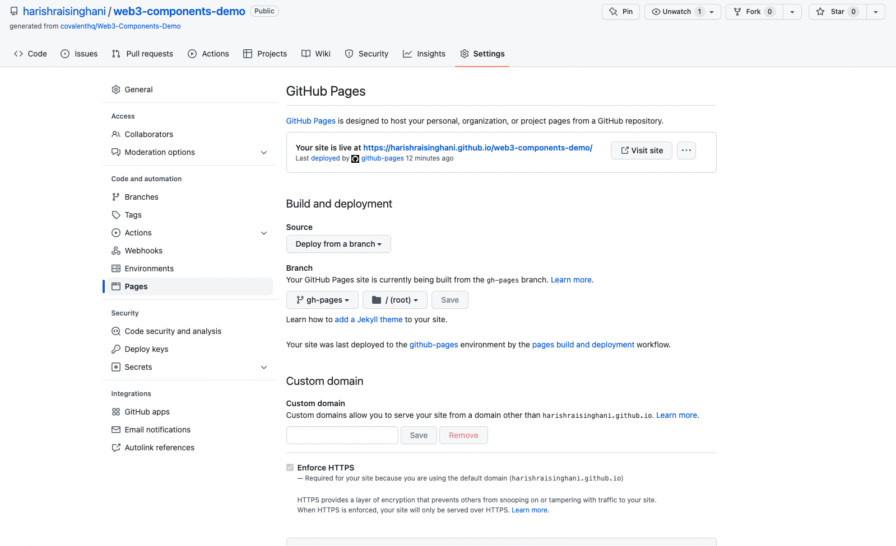
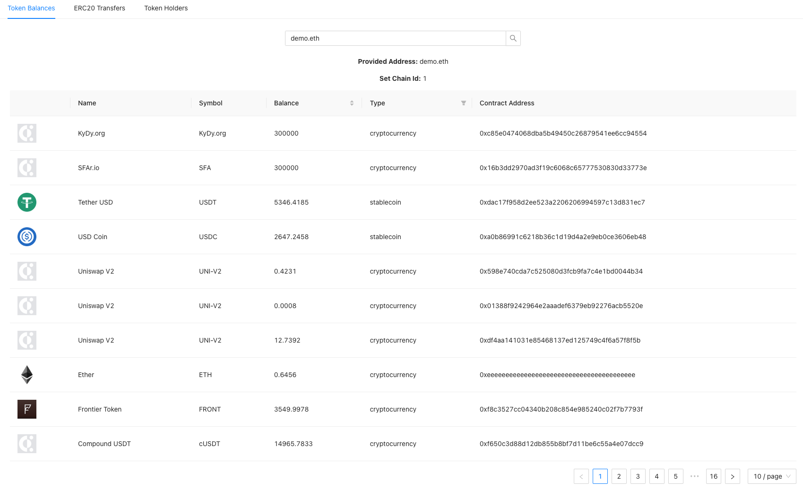

# Web3 Components Demo

**Live demo:** https://covalenthq.github.io/Web3-Components-Demo

This is a live demo of the [Web3 Components Library](https://github.com/covalenthq/web3-components) powered by the [Covalent Unified API](https://www.covalenthq.com/?utm_source=web3_components&utm_medium=docs) and built using the `create-react-app` framework.

## Quick start

### Local development
1. Click _Use this template_ to fork this repo.
2. Create an `.env` file in the project folder and set the variable: `REACT_APP_COVALENT_API_KEY`=[Your Covalent API Key](https://www.covalenthq.com/platform/)
3. Run `npm start`

&nbsp;
### Deploy to GitHub Pages
1. Click _Use this template_ to fork this repo. **Make sure to select: _Include all branches_**. 
2. Under _Settings -> Secrets -> Actions_, click _New repository secret_

    

3. Add your Covalent API key as the secret with the name: `REACT_APP_COVALENT_API_KEY`
    

4. Go to your `package.json` and update the `"homepage"` URL value to include your username and repository name: `"https://<username>.github.io/<repository-name>"`. Commit changes to the `main` branch. 
    

5. When the automatic GitHub page build workflow is completed, visit your homepage URL to see the Web3 Components Demo app running on your GitHub page. 
    

6. Use this template to customize your app using these web3 components!
    

Please refer to the [API reference](https://www.covalenthq.com/docs/api/#/0/0/USD/1?utm_source=web3_components_demo&utm_medium=docs) for documentation on how the Covalent Unified API works.

&nbsp;
## Feedback & Support
We love our community and want to help *everyone* build in web3 :muscle:

If you have any feedback or need any support with using any of the web3 components or the Covalent API, message us in our [Discord](https://covalenthq.com/discord) in the `#feedback-and-support` channel.
